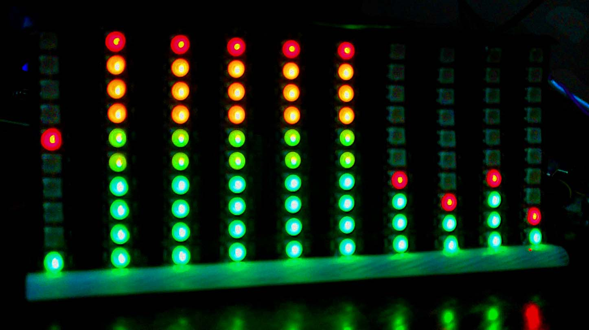

# ESP32 Audio Spectrum Analyzer Display
This project implements an audio spectrum analyzer display using ESP32.   

## Features
- **LED Display:**  Captures the audio and visualizes the audio frequencies as levels via WS2812B RGB LED strip/matrix. 
- **Configuration Web Portal** - Provides an integrated web portal that can be accessed via the IP address of the ESP32 and via the URL [http://sad.local](http://sad.local). The portal enables you to configure the display behavior and properties such as LED colors, transition speed, peak delay, amplification, LED brightness, etc.   

## How it Works
The application does the following at a high level:
- Captures analog audio through the ADC / I2S interface of the ESP32 (GPIO pin 36). 
- Performs Fast Fourier Transform (FFT) on the captured audio buffer and puts the frequencies into specified bands. ArduinoFFT library is used for FFT functions.
- Visualizes the frequencies as bar display levels through WS2812B RGB LED strip connected to the GPIO pin 18. FastLED library is used as the LED driver.
- Provides an integrated web portal, which runs on a dedicated core of the ESP32, to provide an interface to configure different properites and behaviors of the display.   

## Hardware Details
- **Development Board**: This project was developed and tested on the commonly available ESP32-WROOM-32 development board. ESP32 is a popular microcontroller with dual-core Xtensa 32-bit CPU clocked at 240 MHz with 520KB SRAM, built-in WiFi and Bluetooth capabilities. Example Amazon product link to the product: [ELEGOO-ESP-WROOM-32-Development-Bluetooth-Microcontroller](https://www.amazon.ca/ELEGOO-ESP-WROOM-32-Development-Bluetooth-Microcontroller/dp/B0D8T7Z1P5)
- **LED Strip**: Commonly available WS2812B RGB LED strip. Example Amazon product link: [WS2812B-Strip-Addressable-Pixel-Light](https://www.amazon.ca/WS2812B-Strip-Addressable-Pixel-Light/dp/B09P8MH56K)
- **Audio Input**: Audio signals can be fed into ESP32's ADC0 interface (GPIO pin 36) from any analog audio output.  In this project, a tiny dedicated Bluetooth audio receiver board was used for this purpose. Example Amazon product link: [Bognajin-Bluetooth-Decoder-Voltage-Amplifier](https://www.amazon.ca/Bognajin-Bluetooth-Decoder-Voltage-Amplifier/dp/B0D6B7V225)

A complete connection setup is shown below:

## Running the project
To run the project follow these instructions:
- On Windows, install [Visual Studio Code](https://code.visualstudio.com/) and [PlatformIO Arduino IDE plugin for VSCode](https://platformio.org/install/ide?install=vscode).
- Download/clone the _Esp32SpectrumAnalyzer_ folder in this repo.
- Open the folder in Visual Studio Code PlatformIO.
- In main.cpp file, modify the variables _NUM_LEVELS_ and __bandTable_ to match the rows and columns of your LED display setup.
- Compile the code from within PlatformIO.
- Connect ESP32 development board via USB port and flash it. 
- Connect LED strip, audio source, etc., and test the setup.

To access the configuration portal, do the following:
- When you run the first time, if your ESP32 module has never connected to the local WiFi before, it will go into WiFi AP mode, waiting for the WiFi connection to be set up. In this case, look for a WiFi network named "SpectrumAnalyzer" from your mobile device.  Connect to it and complete the WiFi setup.   
- After successful connection to the WiFi, make a note of the ESP32's IP address via the PlatfomIO's Serial monitor output.  Then, access the portal using a browser from a mobile device or computer connected to the same WiFi network.
- If you do not know the IP address of the ESP32, you can use the URL [http://sad.local](http://sad.local).  Since this uses DNS multicast, it may not always work with certain devices such as certain Android phones, etc. 
- If the above does not work either, you can still find out the IP address of your ESP32 through the connected devices page of your WiFi router.

