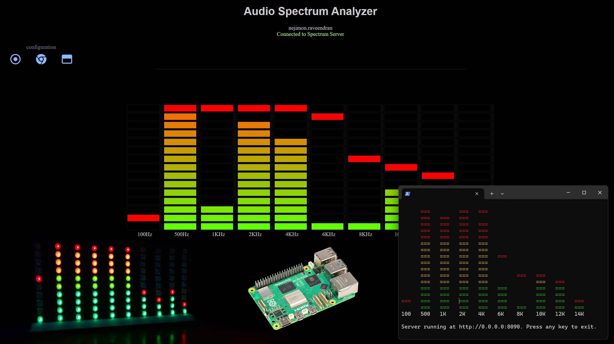
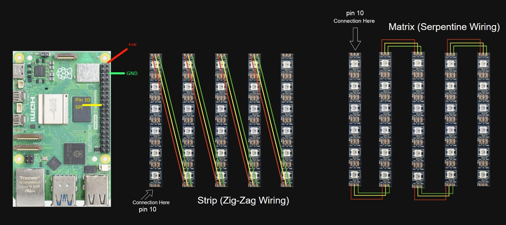

# Raspberry Pi Audio Spectrum Analyzer Display Using .NET
This project implements an audio spectrum analyzer display on Raspberry Pi using C#.NET.  It captures the audio currently being played on the Pi (e.g., via bluetooth, on the Desktop, etc.) and converts the audio signals into the visualization of frequency levels. 



## Features
### 3 Types of Displays
The spectrum analyzer display can plot the visualization output to 3 types of displays:
- **Web Display:**  Display shown on the home page of the application's integrated web portal (default port: 8090).  Web Display is enabled by default.
- **Console/Terminal Display:**  Display directly on the Pi's Terminal or the Terminal of a device connected via SSH (eg. Windows laptop).  Console Display is enabled by default.
- **LED Display:**  Display via WS2812B RGB LED strip or matrix connected to the GPIO pin 10 of the Pi. LED Display is disabled by default.  Refer to the [LED Display Setup](#led-display-setup---optional-reboot-required) to see how to enable LED Display. 

### Integrated Web Portal 
- An integrated web portal runs on port 8090.  This portal can be accessed via http://localhost:8090 or via other devices on the local network through the Pi's host name (for e.g., http://raspberrypi.local:8090).
- Ability to configure the colors of the visualization display.
- Ability to configure various properties of the display such as speed, peak delay, amplification, LED display brightness, etc.   

### Configurable via Command Line
- **Turn on/off displays:** You can run all 3 types of displays at the same time or turn on/off one or more via command-line options.  Refer to the [Command Line Reference](#command-line-reference) section in this document for supported command line options. 
- **Band selection:** You can configure frequency bands (Hz) via command line.
- **Web portal port selection:** You can change the default port (8090) to a custom port via command line. 

## How it Works
The application does the following at a high level:
- Captures the audio using ALSA (Advanced Linux Sound Architecture) APIs. We use [Alsa.NET C# nuget library](https://www.nuget.org/packages/Alsa.Net) for this. 
- Performs Fast Fourier Transform (FFT) on the captured audio buffer using [FftSharp C# nuget library](https://www.nuget.org/packages/FftSharp) and puts the frequencies into specified bands.
- Visualizes the frequencies as bar display levels through Web Display, Console/Terminal Display, and WS2812B RGB LED Display/Matrix.

## Device Support
This project was developed on Raspberry Pi 5 running Raspberry Pi OS Debian Bookworm (both full desktop OS and OS Lite).  It was also tested on Raspberry Pi Zero 2W with the same OS. While this may work on other versions of Raspberry Pi and/or other operating systems, it was not tested on them, and it may require modifications according to the hardware/OS Platform.  For the RGB LED display, any WS2812B RGB LED strip or matrix commonly available in the market (e.g., on Amazon) can be used (refer to the LED Matrix Setup section below).

## LED Display Setup - Optional (Reboot Required)
If you plan to connect WS2812B RGB LED strip or matrix, follow the instructions provided in this section. For reference the following were tested:
- **LED Strip**: https://www.amazon.ca/WS2812B-Strip-Addressable-Pixel-Light/dp/B09P8MH56K
- **LED Matrix**: https://www.amazon.ca/CANADUINO-Matrix-Fully-addressable-WS2812B/dp/B07PJQNCX6

The LED display is driven through the Serial Peripheral Interface (SPI) of the Pi (GPIO pin 10). To configure SPI settings (Debian Bookworm OS):
- **Enable SPI interface:**  Open _/boot/firmware/config.txt_ in a text editor such as Nano.  Look for the following lines.  If you do not find them there, add them at the end of the file:
```
dtparam=spi=on
core_freq=250
core_freq_min=250
```

**Set SPI buffer size:**  Open _/boot/firmware/cmdline.txt_ in a text editor and add the following at the end of the file (if not already exists):
```
spidev.bufsiz=65536
```

After the above steps are complete, you MUST restart the Pi so that the SPI settings take effect upon next boot.

```
sudo reboot now
```


To connect the WS2812B LED strip or matrix to the GPIO pin 10 (SPI), refer to the following diagram.  There are 2 types of wirings supported, as in the below image:


Selection of the wiring can be controlled through command-line arguments. Refer to the [Command Line Reference](#command-line-reference).

## Running the project
Before you can run the project, you must install the following prerequisites on the Pi:

```
sudo apt install bluez blueman pulseaudio pulseaudio-module-bluetooth -y 
sudo apt install libasound2-dev -y
```

PulseAudio acts as the sound server.  PulseAudio combined with libasound2-dev binaries facilitate the capture of audio from the underlying ALSA system through our libraries.  After the installation of the above, start PulseAudio with following command:  
```
pulseaudio --start
```
The above command usually needs to be executed only once.  Normally, when the Pi starts next time, PulseAudio server also starts automatically.

Now you can run the project. You can do so in 2 ways:
- **Run as Docker container:**  This is the easier and simpler approach so that you do not have to download the code and compile it.  If you already have Docker installed, use the following command to run this project:

```
docker run --rm -it -p 8090:8090 \
  --privileged \
  --user $(id -u):$(id -g) \
  --group-add $(getent group spi | cut -d: -f3) \
  --env PULSE_SERVER=unix:${XDG_RUNTIME_DIR}/pulse/native \
  --env PULSE_COOKIE=/tmp/pulseaudio.cookie \
  --volume ${XDG_RUNTIME_DIR}/pulse/native:${XDG_RUNTIME_DIR}/pulse/native \
  --device /dev/snd \
  nejimonraveendran/rpispectrumanalyzer:v1
```

If you do not have Docker installed, you can install Docker using the commands provided in the _run-docker.sh_ file in the source code folder. 

- **Run locally:**  You can clone this repo onto the Pi, open it in Visual Studio Code via SSH, build it, and run.  If you don't want to edit the code, you can use the commands provided in the _run-local.sh_ to install the dependencies, clone the repo, build the code, and then run it from the Terminal command line. 

Regardless of which method you use, by default, this will run the application on port 8090.  If you are using Rasperry Pi OS Desktop, you can access the application's web interface through the browser at the address:

```
http://localhost:8090
```

If you want to access from other devices on the same network, use the Pi's host name or LAN IP address.  For example:

```
http://raspberrypi.local:8090
```

Now play some audio on your Raspberry Pi, and you should be able to see the audio being visualized as different frequency bands.


## Connecting Bluetooth Audio Devices
If you want to visualize Bluetooth audio from another device such as your phone, first you need to pair the device with the Pi. This can be done directly from Pi's desktop or via command line. If you want to do it via command line (e.g., SSH Terminal), use the following method to pair the new device:

First of all, issue the command and press Enter:
```
bluetoothctl
```
On the prompt that appears, issue commands:

```
power on
discoverable on
scan on
```

The above command will start listing the Bluetooth devices around.  Look for the name of the device you want to pair with and note down the MAC address of the device once it appears in the list.  Pair the device using the following commands:

```
pair <mac_address>
trust <mac_address>
```
Once the device is successfully paired, exit the prompt by typing:
```
exit 
```

To view already paired/connected devices, you can use:
```
bluetoothctl devices Paired
bluetoothctl devices Connected
``` 

If not already connected, you can connect an already paired device using the command:
```
bluetoothctl connect <mac_address>
```

If you are connecting your phone, the above command will list the Pi as a paired/connected device on the phone as well. 


## Command Line Reference
The RpiSpectrumAnalyzer application can be started with different command line options to control its behavior.

The supported options are:

``` --port ``` 

Specifies a non-default port for the integrated web portal. Example:
```
./RpiSpectrumAnalyzer --port 8000
```

``` --console-display-levels ``` 

Specifies the number of Console/Terminal display levels (rows).  Default is 16.  Example:
```
./RpiSpectrumAnalyzer --console-display-levels 20
```

``` --led-display-levels ``` 

Specifies the number of LED Matrix display levels (rows).  Default is 10.  Example:
```
./RpiSpectrumAnalyzer --led-display-levels 15
```

``` --web-display-levels ``` 

Specifies the number of Web display levels (rows).  Default is 15.  Example:
```
./RpiSpectrumAnalyzer --web-display-levels 20
```

``` --disable-console-display ``` 

Disables console display.  Default is enabled.  Example:
```
./RpiSpectrumAnalyzer --disable-console-display
```

``` --disable-web-display ``` 

Disables web display.  Default is enabled.  Example:
```
./RpiSpectrumAnalyzer --disable-web-display
```

``` --enable-led-display ``` 

Enables RGB LED display.  Default is disabled. The default behavior is by design based on the assumption that not every user may have a WS2812B RGB LED strip/matrix available or connected to the Pi.  If you enable the display, you MUST also enable the Pi's SPI settings.  You must also specify the number of columns in the LED Matrix via the option ```--led-display-cols ```.  Example:
```
./RpiSpectrumAnalyzer --enable-led-display --led-display-cols 8
```


``` --bands ``` 

Specifies custom band frequencies in Hz as comma separated values surrounded by double quotes.  Default is 10 bands. If you use RGB LED display, the maximum number of bands MUST NOT exceed be the number of columns in the LED matrix. Otherwise, an error will be thrown or unexpected display behavior might happen.  Example:

```
./RpiSpectrumAnalyzer --bands "100, 500, 1000, 2000, 4000, 6000, 8000, 10000, 12000, 14000"  

```

``` --led-display-wiring [serpentine, s | zigzag, z]```
There are 2 types of LED wiring supported:
-  **Zig-Zag Wiring:** This is the default. Use this option if your LED display is wired in a zig-zag fashion.  Refer to the [LED Display Setup](#led-display-setup---optional-reboot-required). This is especially useful if you are building the columns of the display by cutting pieces out of a WS2812B LED strip and soldering them.  
-  **Serpentine Wiring:** LED matrices are usually wired in a serpentine fashion.  Use this option if you are using a readily available WS2812B LED matrix or if you wire the display in the serpentine fashion.

Default is Zig-Zag wiring.

Example usage (Serpentine):
```
./RpiSpectrumAnalyzer --led-display-wiring s
```

Note:  If you are running the Docker image, you can use the above commands as in the following example:

```
docker run --rm -it -p 8090:8090 \
  --privileged \
  --user $(id -u):$(id -g) \
  --group-add $(getent group spi | cut -d: -f3) \
  --env PULSE_SERVER=unix:${XDG_RUNTIME_DIR}/pulse/native \
  --env PULSE_COOKIE=/tmp/pulseaudio.cookie \
  --volume ${XDG_RUNTIME_DIR}/pulse/native:${XDG_RUNTIME_DIR}/pulse/native \
  --device /dev/snd \
  nejimonraveendran/rpispectrumanalyzer:v1 \
  --enable-led-display \
  --led-display-cols 8 \
  --led-display-levels 8 \
  --bands "100, 500, 1000, 2000, 4000, 6000, 10000, 14000" \
  --led-display-wiring serpentine
```

## Final Words

There are many more things that can be implemented in this project, but I have not done so because of the time constraints. Contributions are welcome.  Currently, I have not set up related settings.  However, if you are interested in contributing to this project, please let me know via opening an issue, etc., and I will consider setting up for contributions.  Some of the backlog I can think of:
- Ability to persist the configuration/settings on the server side in a database.
- More types of visualizations.
- Support for more devices/platforms.
- Converting the UI from jQuery to a more modern framework such as Angular, React, etc.
- Converting Web Sockets to the newer Server Sent Events available in .NET 10.
- Potentially other features :)


